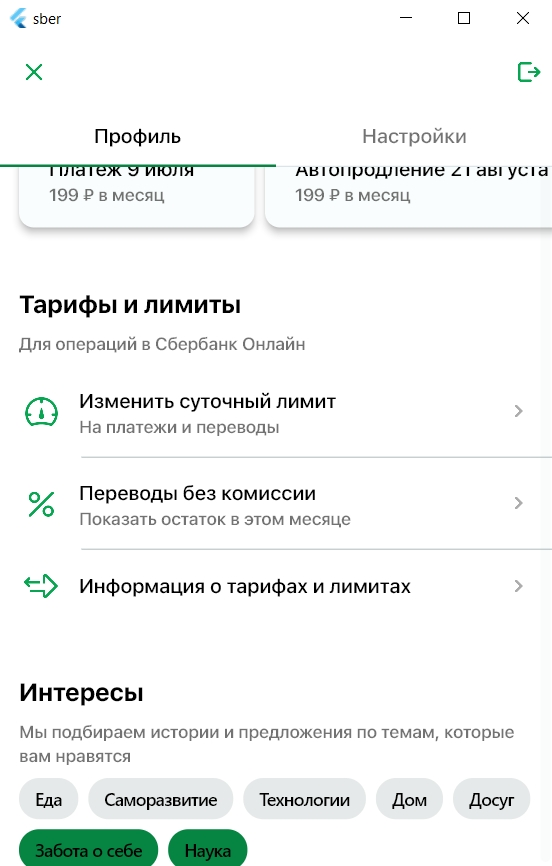

# Лабораторная работа 1 по Flutter

<u>*Задание*</u>: разработать Flutter приложение по следующему [макету](https://www.figma.com/file/T53qEeDxWunzfRMuqRGvz9?type=design%27&node-id=1:177). 

Версия Flutter: 3.16.1

Версия Dart: 3.2.1

Чтобы запустить проект, необходимо клонировать репозиторий командой ниже

```git
git clone https://github.com/juliazubova/effective_android.git effective_android  --branch develop
```

<u>*Результат*</u>: 

|||
|:-:|:-:|